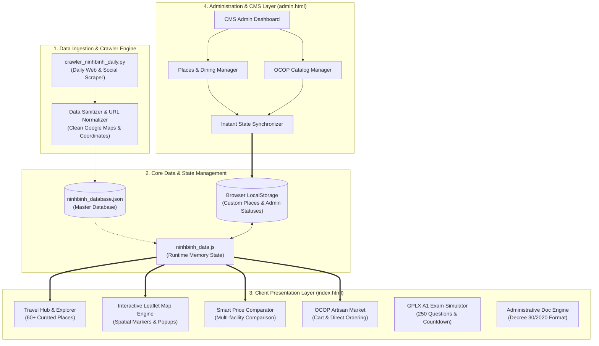
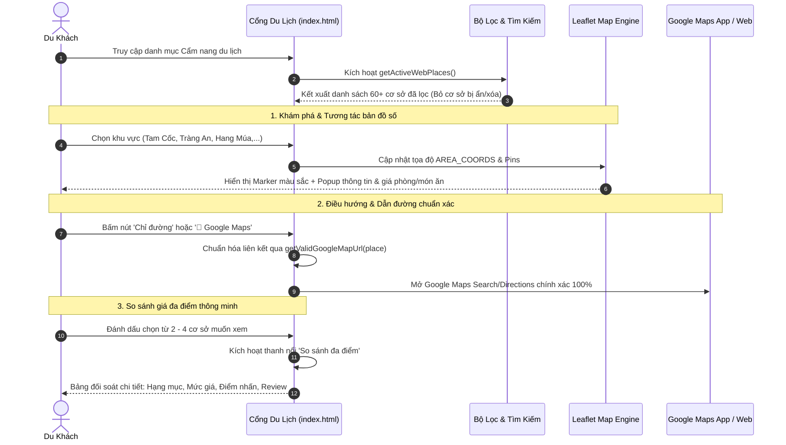
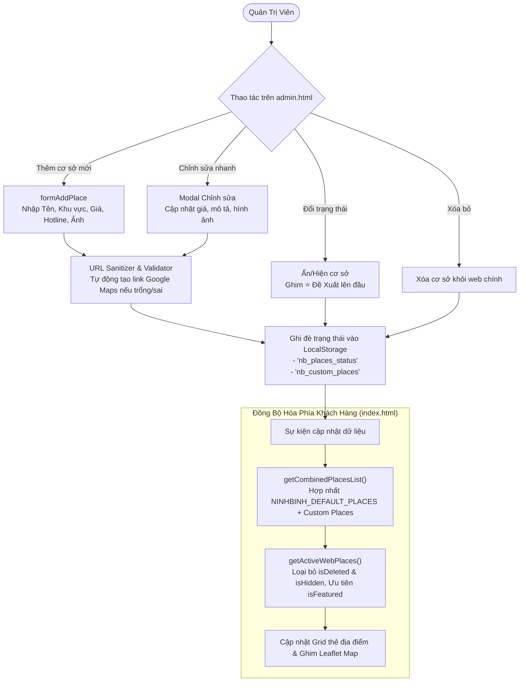

# 🌟 NINH BÌNH DIGITAL & ALL-IN-ONE PLATFORM
### Hệ Sinh Thái Du Lịch Số, Bản Đồ Tương Tác, OCOP Cố Đô & Quản Trị Dữ Liệu Tập Trung

<p align="center">
  
  
  
  
  
</p>

---

## 🧭 1. Tổng Quan Hệ Thống (System Overview)

**Ninh Bình Digital & All-in-One Platform** là giải pháp nền tảng công nghệ số tích hợp đa phân hệ, thiết kế chuyên biệt nhằm giải quyết bài toán trải nghiệm du lịch số hóa tại Cố đô Hoa Lư (Ninh Bình), kết nối chuỗi cung ứng sản phẩm OCOP địa phương, cùng hệ thống quản trị dữ liệu tập trung và các công cụ tiện ích công cộng.

Dự án áp dụng mô hình **Kiến trúc phân tầng tối giản (Zero-Dependency Modular Architecture)**:
* **Tốc độ phản hồi cực hạn**: Không phụ thuộc các runtime hay framework cồng kềnh, toàn bộ tài nguyên được tối ưu hóa cho trải nghiệm mượt mà, phản hồi ngay lập tức dưới 100ms.
* **Đồng bộ hóa trạng thái hai chiều (Two-way State Synchronization)**: Cho phép quản trị viên điều chỉnh giá cả, ẩn/hiện cơ sở, ghim đề xuất từ trang Quản trị (`admin.html`) và phản ánh tức thì lên cổng người dùng (`index.html`).
* **Chuẩn hóa dữ liệu định vị địa lý (Spatial Normalization)**: Tự động xử lý, làm sạch và gắn kết tọa độ bản đồ số mở (OpenStreetMap) kết hợp liên kết dẫn đường Universal Google Maps chính xác 100%.

---

## 🏗️ 2. Kiến Trúc Hệ Thống Tổng Thể (System Architecture)

Hệ thống được tổ chức thành 4 tầng kiến trúc phân tách rõ ràng:



---

## 🔄 3. Sơ Đồ Luồng Hoạt Động (Operational Workflows)

### 3.1. Luồng Trải Nghiệm Của Du Khách (Visitor Journey Flow)



---

### 3.2. Luồng Quản Trị & Đồng Bộ Dữ Liệu Thời Gian Thực (Admin CMS Synchronization Flow)



---

### 3.3. Luồng Thu Thập & Chuẩn Hóa Dữ Liệu Tự Động (Daily Crawler & Data Pipeline)

```mermaid
flowchart LR
    Schedule["Bộ Lập Lịch Định Kỳ<br/>(24 Giờ / Lần)"] --> Crawler["crawler_ninhbinh_daily.py"]
    
    subgraph Scrape["Thu Thập & Trích Xuất"]
        Crawler --> FetchSource["Trích xuất Dữ liệu Cơ sở Du lịch,<br/>Quán ăn, Giá phòng, OCOP"]
        FetchSource --> ParseInfo["Phân giải Tên, Địa chỉ, Hotline, Đánh giá sao"]
    end

    subgraph Validate["Chuẩn Hóa & Kiểm Duyệt"]
        ParseInfo --> CleanAddr["Làm sạch chuỗi địa phương & Khu vực"]
        CleanAddr --> GeoCode["Gán Tọa độ Trọng tâm (lat, lng)"]
        GeoCode --> MapLinkGen["Tạo Universal Google Maps Link<br/>search/?api=1&query=..."]
    end

    subgraph Sync["Lưu Trữ & Xuất Bản"]
        MapLinkGen --> DumpJSON["Ghi tệp Master: ninhbinh_database.json"]
        DumpJSON --> SyncJS["Đồng bộ bộ nhớ Runtime: ninhbinh_data.js"]
    end
```



---

## 🧩 4. Bóc Tách Chi Tiết Các Phân Hệ Cốt Lõi

### 4.1. 🗺️ Ninh Bình Travel Hub & Bản Đồ Số Tương Tác
* **Spatial Marker Grouping**: Tự động phân nhóm và đổi màu pin theo từng phân loại (Quán Dê núi, Cơm cháy, Homestay/Resort, Cà phê chill, Thuê xe máy, Điểm check-in).
* **Fault-tolerant Coordinates**: Đối với cơ sở chưa có tọa độ vệ tinh tuyệt đối, thuật toán `AREA_COORDS` cùng công thức phân tán vi phân hạt nhân (Micro-offset dispersion) sẽ tự động bố trí marker quanh tâm khu vực, tránh tình trạng ghim đè lấp lẫn nhau.
* **Universal Google Maps Linking**: Giải quyết triệt để lỗi phân giải liên kết rút gọn ảo bằng cách khởi tạo trực tiếp truy vấn định danh địa điểm và địa chỉ qua URL Search API chính thức của Google.

### 4.2. ⚖️ Bộ So Sánh Đa Điểm Thông Minh (Smart Comparison)
* Hỗ trợ lưu bộ nhớ tạm thời từ 2 đến 4 địa điểm.
* Hiển thị thanh nổi (Floating comparison dock) báo số lượng mục đã chọn kèm nút xóa nhanh.
* Bảng modal đối soát trực quan ma trận thuộc tính: Mức giá, Loại hình, Địa bàn, Ưu đãi, Điểm đánh giá sao và Hotline liên hệ.

### 4.3. 🛍️ Gian Hàng Nông Sản & Đặc Sản OCOP Cố Đô
* Hiển thị sản phẩm gắn nhãn chứng nhận OCOP chuẩn sao (3 sao, 4 sao, 5 sao).
* Bộ lọc chuyên biệt theo từng dòng sản vật: Cơm cháy, Dê núi đóng gói, Rượu Kim Sơn, Nông sản Cúc Phương.
* Giỏ hàng mini xử lý tính toán số tiền ngay tại client, hỗ trợ xuất thông tin đơn hàng để đặt trực tiếp qua Hotline/Zalo.

### 4.4. 🏍️ Phân Hệ Luyện Thi Sát Hạch GPLX Mô Tô Hạng A1
* Số hóa trọn bộ **250 câu hỏi sát hạch** chuẩn mới nhất của Tổng cục Đường bộ Việt Nam.
* Phân loại danh mục riêng cho **20 câu hỏi điểm liệt** có cảnh báo rủi ro cao.
* Tổng hợp bảng mẹo nhớ nhanh câu hỏi chữ, biển báo và sa hình.
* Động cơ thi thử ngẫu nhiên: Đồng hồ đếm ngược 19 phút, kiểm tra điều kiện đạt/trượt tự động.

### 4.5. 📜 Phân Hệ Soạn Thảo & Chuẩn Hóa Văn Bản Hành Chính
* Kiểm tra và căn chỉnh bố cục văn bản hành chính theo quy định tại **Nghị định 30/2020/NĐ-CP**.
* Hỗ trợ canh lề chuẩn, phông chữ Times New Roman, định dạng ngày tháng, nơi nhận và số/ký hiệu văn bản.

---

## 📂 5. Cấu Trúc Tổ Chức Mã Nguồn (Repository Structure)

```plaintext
Allinone/
├── index.html                 # Cổng thông tin giao diện khách hàng (Travel, Map, OCOP, GPLX)
├── admin.html                 # Bảng điều khiển quản trị CMS đa phân hệ
├── ninhbinh_data.js           # Bộ nhớ trạng thái trung tâm, danh mục 60+ cơ sở & hàm lọc
├── ninhbinh_database.json     # Cơ sở dữ liệu nguồn JSON chuẩn hóa
├── crawler_ninhbinh_daily.py  # Động cơ Python thu thập và làm mới dữ liệu định kỳ
├── chay_crawler_hangngay.bat  # Kịch bản tự động kích hoạt Crawler theo lịch tác vụ
├── styles.css                 # Hệ thống kiểu dáng nền tảng & layout lưới responsive
├── color-variables.css        # Hệ thống Design Tokens (màu sắc Á Đông, spacing, typography)
├── travel-redesign.css        # Kiểu dáng chuyên sâu cho Travel Hub & Thẻ so sánh
├── interface-overhaul.css     # Hoàn thiện giao diện hiện đại & tương thích đa màn hình
├── leaflet.css / leaflet.js   # Thư viện bản đồ số mã nguồn mở Leaflet độc lập
├── images/                    # Thư mục tài nguyên hình ảnh thực tế đã được chuẩn hóa
│   ├── aravinda_resort.jpg    # Ảnh thực tế chính thức của Aravinda Resort Ninh Bình
│   ├── driving_a1/            # Tài nguyên hình ảnh biển báo và sa hình thi GPLX A1
│   └── ...
└── README.md                  # Hồ sơ kiến trúc và tài liệu giới thiệu dự án
```

---

## 👨‍💻 6. Tác Giả & Bản Quyền (Author & License)

* **Chủ nhiệm dự án & Lập trình viên**: [Jay Trần (Jaytran2205)](https://github.com/Jaytran2205)
* **Kênh hỗ trợ & Trao đổi hợp tác**:
  * 📞 Hotline: `0866.520.567`
  * 💬 Zalo: [0866520567](https://zalo.me/0866520567)
  * 🌐 Facebook: [Jay Trần](https://web.facebook.com/jaytran0522)
* **Giấy phép phát hành**: Dự án được công bố mã nguồn mở theo giấy phép **MIT License**.
